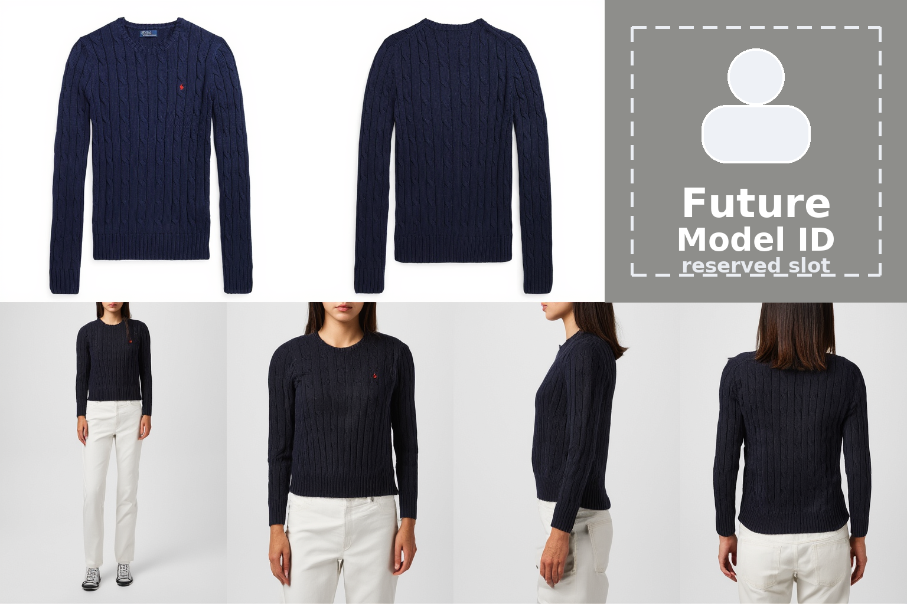
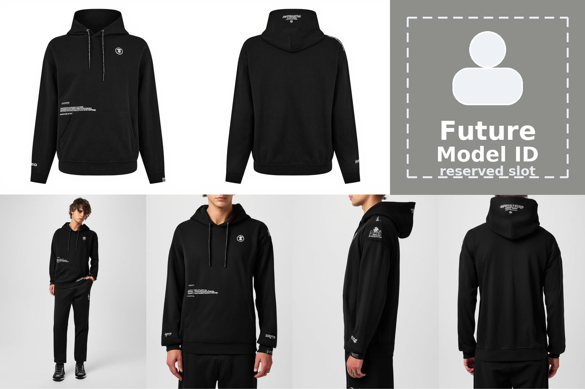
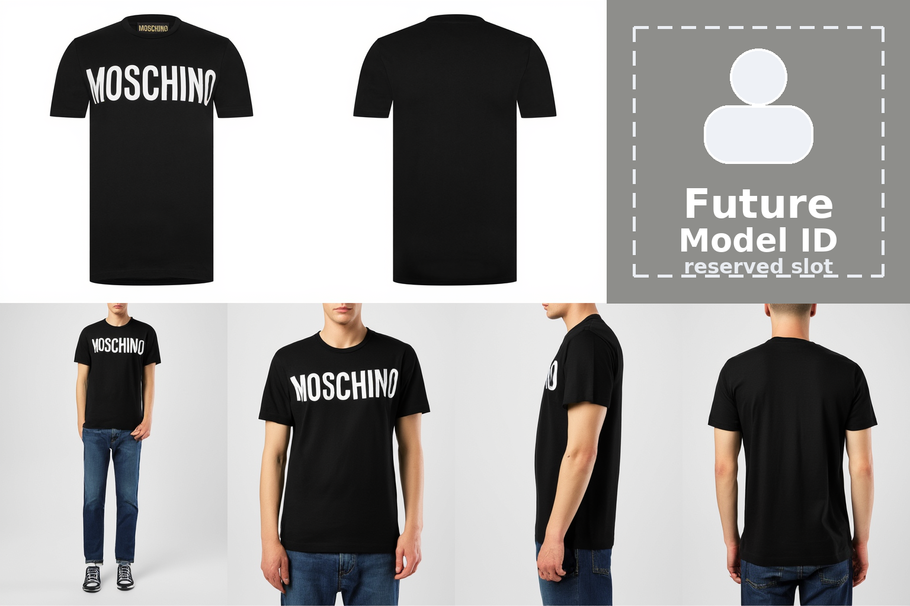

# DualViewFashion

### Dual-View Garment-Conditioned Multi-View Fashion Model Generation

> A FLUX-Fill based generative framework that synthesizes four coherent fashion-model views from dual-view garment references in a single inpainting forward pass.

---

DualViewFashion formulates multi-view fashion model generation as a **structured inpainting** problem. Given paired garment views, typically the front and back of a clothing item, we construct a canonical 7-region canvas and use **FLUX Fill** to complete the masked model-view regions. The system generates a synchronized set of model images, including reference-pose, front, side, and back views, without editing an existing person image.

This is **not** a virtual try-on or person-inpainting pipeline. DualViewFashion creates a new fashion model presentation conditioned by garment references.

## Highlights

- **Dual-View Garment Conditioning.** Instead of relying on a single product image, DualViewFashion conditions generation on paired garment views. The front view provides appearance cues such as color, print, neckline, and silhouette; the back view preserves reverse-side structure and rear-view design details.

- **Single-Pass Four-View Synthesis.** We cast multi-view generation into a single FLUX-Fill inpainting canvas. One forward pass produces four model views: reference-pose, front, side, and back. This avoids independently sampling each viewpoint and reduces cross-view drift.

- **Layout-Constrained Inpainting.** The model receives a 7-region layout: two garment reference slots, one identity placeholder slot, and four masked model-view slots. The inpainting objective encourages the model to respect the garment evidence while completing all target views jointly.

- **Identity Placeholder for Future Control.** The gray slot in the reference row is intentionally reserved. In the current release it is filled with a neutral gray placeholder and annotated in the examples; future versions will replace this slot with a model identity reference, enabling generation of a fixed model identity wearing the target garment.

- **Image-First, Video-Ready.** The core contribution is multi-view image generation. We also provide an optional Wan2.2 multi-frame reference video inference script, where multiple reference images are injected as sparse temporal conditions.

## TODO

- [x] Image inference code release
- [x] Wan2.2 multi-frame reference video inference code release
- [x] Example gallery release
- [ ] Low-resolution checkpoint release (512 x 384)
- [ ] High-resolution checkpoint release (1024 x 768)
- [ ] Image training code release
- [ ] Wan2.2 video checkpoint release
- [ ] Wan2.2 video training code release
- [ ] Dataset release
- [ ] Model-identity conditioned generation

## Examples

Each example below is generated from the 1024-resolution evaluation setting. The output canvas contains the dual-view garment references in the first row and four generated model views in the second row. The top-right gray region is the reserved model-identity slot, annotated here to indicate our future identity-control plan.

| Example | Generated multi-view canvas |
|:---:|:---:|
| Example 1 |  |
| Example 2 |  |
| Example 3 |  |

## Quick Start

### Environment

```bash
conda create -n search-train python=3.10 -y
conda activate search-train
pip install -r requirements.txt
```

DualViewFashion image inference was tested with `diffusers` `0.39.0.dev0` and a `FluxFillPipeline`-compatible FLUX Fill implementation.

### Image Inference

```bash
python inference.py \
  --garment_front path/to/garment_front.jpg \
  --garment_back path/to/garment_back.jpg \
  --model_path path/to/FLUX.1-Fill-dev \
  --lora_path path/to/dualviewfashion-highres-lora \
  --output outputs/dualviewfashion_grid.png \
  --cloth_type "dress" \
  --gender "female" \
  --steps 50 \
  --guidance_scale 1.0 \
  --seed 0
```

The generated image is a single 7-region canvas. The bottom row contains four synchronized model renderings produced by one inpainting pass.

### Optional Video Inference

```bash
python video_inference.py \
  --model_dir path/to/Wan2.2-I2V-A14B \
  --ref_images ref_000.png ref_025.png ref_050.png ref_075.png \
  --frame_positions 0 0.25 0.5 0.75 \
  --high_lora path/to/dualviewfashion-wan22-high-noise.safetensors \
  --low_lora path/to/dualviewfashion-wan22-low-noise.safetensors \
  --prompt "a fashion model walks in, poses, turns around, and walks out, full body, studio lighting" \
  --output outputs/dualviewfashion_video.mp4
```

The video LoRA checkpoints are coming soon. The LoRA paths above are placeholders until checkpoints are published.

## Checkpoints

| Model | Status |
|---|---|
| DualViewFashion low-resolution LoRA (512 x 384) | Coming soon |
| DualViewFashion high-resolution LoRA (1024 x 768) | Coming soon |
| DualViewFashion Wan2.2 video LoRA | Coming soon |
| DualViewFashion dataset | Coming soon |

## Architecture

```text
                 +------------------------------------------------+
                 |                DualViewFashion                 |
                 |          FLUX-Fill Layout Inpainting           |
                 |                                                |
Garment Front -->|  [ Garment Front ] [ Garment Back ] [ ID Slot ]|
Garment Back  -->|                                                |
Identity Slot -->|  [ Ref-Pose ] [ Front ] [ Side ] [ Back Model ]|--> Four model views
Masked Targets ->|                                                |
                 +------------------------------------------------+
```

**Key difference from virtual try-on pipelines:**

| | Virtual Try-On / Person Inpainting | DualViewFashion |
|---|---|---|
| Input person | Required | Not required |
| Target task | Edit clothing on an existing person | Generate new fashion model views |
| Garment evidence | Often single-view | Dual-view garment references |
| View generation | Usually one edited image | Four coordinated model views |
| Generation process | Person-region inpainting | Layout-conditioned multi-view inpainting |

## How It Works

1. **Canvas Construction.** The front and back garment images are placed in the first two reference slots. A neutral gray identity placeholder is placed in the third reference slot.
2. **Mask Definition.** The complete bottom row is masked as the target region for generation.
3. **FLUX-Fill Inpainting.** A LoRA-adapted FLUX Fill model completes the masked region in one pass, producing four synchronized fashion-model views.
4. **Future Identity Control.** The gray placeholder will be replaced by a model identity reference, allowing the same model identity to be rendered wearing different garments.

## Training

DualViewFashion adopts a two-stage resolution curriculum:

- **Stage 1 - Low-Resolution Training (512 x 384).** The model first learns the canonical 7-region inpainting formulation, dual-view garment conditioning, and coarse cross-view correspondence at 512 x 384 resolution.
- **Stage 2 - High-Resolution Training (1024 x 768).** Starting from the low-resolution model, we further fine-tune at 1024 x 768 resolution to improve garment texture fidelity, silhouette quality, view consistency, and back-view detail preservation.

Both the low-resolution checkpoint and high-resolution checkpoint are coming soon. Training code and dataset release are also coming soon.

Future extensions include model-identity conditioning through the reserved identity placeholder and Wan2.2 multi-frame reference video training.

## Project Structure

```text
DualViewFashion/
|-- inference.py              # FLUX-Fill image inference
|-- video_inference.py        # Wan2.2 multi-frame reference video inference
|-- assets/examples/          # Generated examples
|-- requirements.txt
|-- README.md
`-- LICENSE
```

## Citation

If you find this work useful, please cite:

```bibtex
@article{dualviewfashion2026,
    title={DualViewFashion: Dual-View Garment-Conditioned Multi-View Fashion Model Generation},
    author={},
    year={2026}
}
```

## Acknowledgments

This project builds upon FLUX Fill for layout-conditioned image inpainting and Wan2.2/DiffSynth for optional multi-frame reference video generation.
